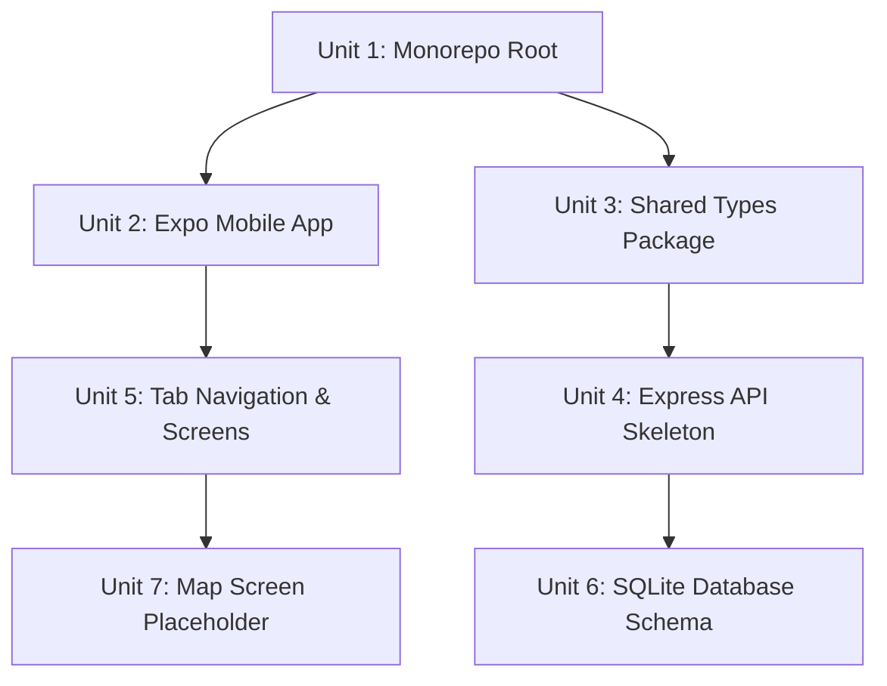

# feat: Initial Project Scaffolding for SUNY Oneonta Campus App

## Overview

Set up the foundational project structure for the SUNY Oneonta campus app — a React Native (Expo) mobile application with a Node.js/Express backend. This scaffolding creates the monorepo structure, configures navigation with tab bar, sets up the Express API skeleton, initializes the SQLite database schema, and establishes shared TypeScript types between frontend and backend.

## Problem Frame

The team needs a working project foundation before feature development can begin. The spec documents (Phases 1-3) define a layered MVC architecture with React Native frontend, Node.js/Express backend, SQLite database, and Redis caching. This plan scaffolds that architecture so the team can immediately begin building the heatmap, lost & found, and admin features.

## Requirements Trace

- R1. Monorepo with Expo frontend, Express backend, and shared types package
- R2. Bottom tab navigation: Map (home), Lost & Found, Reports List, Profile
- R3. Express REST API skeleton with route stubs for issues, lost-found, auth, and admin
- R4. SQLite database with initial schema (Users, Issues, LostFoundItems, Images, AuditLogs)
- R5. Shared TypeScript types for the data entities defined in the spec
- R6. Map screen placeholder with SUNY Oneonta campus center coordinates
- R7. Authentication middleware placeholder (JWT-based as specified in Phase 3)

## Scope Boundaries

- This plan covers scaffolding only — no business logic, no heatmap computation, no matching algorithms
- No deployment configuration (Docker, CI/CD)
- No Redis setup (deferred to heatmap feature work)
- No SSO integration (deferred to auth feature work)
- No image upload implementation (deferred to feature work)
- Admin dashboard is stub routes only

## Key Technical Decisions

- **Expo SDK 55 with Expo Router**: Current stable SDK. Expo Router provides file-based navigation built on React Navigation, which is the recommended approach for new Expo projects. This replaces the need to manually configure React Navigation.
- **expo-maps over react-native-maps**: react-native-maps has a known compatibility issue with SDK 55's mandatory New Architecture (expo/expo#43288). expo-maps is Expo's first-party solution that uses Apple Maps on iOS with no API key required.
- **Monorepo with npm workspaces**: Since the API exists solely to serve the mobile app, sharing TypeScript types between frontend and backend prevents type drift. The monorepo keeps everything in one repo for the student team.
- **better-sqlite3 for the backend**: Synchronous, fast, and simpler than the async sqlite3 package. Appropriate for the expected 200 concurrent users.
- **Flat monorepo (not apps/ nesting)**: For a student team, keeping `mobile/`, `api/`, and `shared/` at the root is simpler than nested `apps/` directories.

## Implementation Units

- [ ] **Unit 1: Initialize Monorepo Root**

  **Goal:** Create the workspace root that ties together the mobile app, API, and shared types.

  **Requirements:** R1

  **Dependencies:** None

  **Files:**
  - Create: `package.json` (workspace root)
  - Create: `tsconfig.base.json`
  - Create: `.gitignore`
  - Create: `.npmrc`

  **Approach:**
  - Initialize with `npm init` at the root
  - Configure npm workspaces pointing to `mobile/`, `api/`, and `shared/`
  - Set up a base tsconfig with strict mode that packages extend
  - .gitignore covers node_modules, .expo, dist, *.db

  **Test expectation:** none -- pure configuration scaffolding

  **Verification:** `npm install` runs without errors from the root

- [ ] **Unit 2: Create Expo Mobile App**

  **Goal:** Scaffold the React Native app using Expo SDK 55 with TypeScript.

  **Requirements:** R1

  **Dependencies:** Unit 1

  **Files:**
  - Create: `mobile/` directory (via `create-expo-app`)
  - Modify: `mobile/package.json` (add workspace dependency on `shared`)
  - Modify: `mobile/tsconfig.json` (extend base config)

  **Approach:**
  - Run `npx create-expo-app@latest mobile` from the project root
  - Update the generated package.json name to `@campusapp/mobile`
  - Add dependency on `@campusapp/shared` workspace package
  - Clean out default template demo screens

  **Test expectation:** none -- scaffolding only

  **Verification:** `npx expo start` launches the dev server without errors

- [ ] **Unit 3: Create Shared Types Package**

  **Goal:** Establish shared TypeScript interfaces for all data entities defined in the spec.

  **Requirements:** R5

  **Dependencies:** Unit 1

  **Files:**
  - Create: `shared/package.json`
  - Create: `shared/tsconfig.json`
  - Create: `shared/src/index.ts`
  - Create: `shared/src/types/user.ts`
  - Create: `shared/src/types/issue.ts`
  - Create: `shared/src/types/lostFound.ts`
  - Create: `shared/src/types/audit.ts`
  - Create: `shared/src/constants/categories.ts`
  - Create: `shared/src/constants/severity.ts`
  - Create: `shared/src/constants/campus.ts`

  **Approach:**
  - Types mirror the data entities from Phase 2 Section 6.1:
    - `User`: id, email, role (student | admin), status (active | suspended | banned), createdAt
    - `Issue`: id, category (Building | Social | Road | Water | Debris | Fight), severity (Mild | Medium | Large | Severe), latitude, longitude, reportCount, status (active | fixed | archived), createdAt, updatedAt, reporterId
    - `LostFoundItem`: id, type (lost | found), title, description, category, latitude, longitude, imageUrls, status (active | claimed | resolved), createdAt, reporterId
    - `AuditLog`: id, adminUserId, action, affectedContentId, timestamp
  - Constants: issue categories, severity levels with color mappings (Mild->Lime, Medium->Yellow, Large->Orange, Severe->Red), campus boundary coordinates for SUNY Oneonta
  - Campus center: approximately 42.4534 N, -75.0640 W

  **Test expectation:** none -- type definitions only

  **Verification:** TypeScript compiles without errors; types are importable from both mobile and api packages

- [ ] **Unit 4: Create Express API Skeleton**

  **Goal:** Set up the Node.js/Express backend with route stubs matching the spec's controller structure.

  **Requirements:** R3, R7

  **Dependencies:** Unit 3

  **Files:**
  - Create: `api/package.json`
  - Create: `api/tsconfig.json`
  - Create: `api/src/index.ts` (Express app entry point)
  - Create: `api/src/routes/issues.ts`
  - Create: `api/src/routes/lostFound.ts`
  - Create: `api/src/routes/auth.ts`
  - Create: `api/src/routes/admin.ts`
  - Create: `api/src/middleware/auth.ts` (JWT placeholder)
  - Create: `api/src/middleware/roleGuard.ts`
  - Create: `api/src/middleware/validateCampusBounds.ts`

  **Approach:**
  - Express app with JSON body parsing, CORS enabled
  - Route stubs return placeholder 501 responses so the frontend can develop against the shape
  - Auth middleware is a passthrough placeholder that reads a Bearer token header (no real validation yet)
  - roleGuard middleware checks user role from request context
  - validateCampusBounds middleware validates lat/lng are within SUNY Oneonta boundary box
  - Routes match the controller structure from Phase 3: HeatmapController, ReportController, LFController, AdminController
  - API routes:
    - `POST /api/issues` - create issue
    - `GET /api/issues` - list issues (with filter query params)
    - `PATCH /api/issues/:id/resolve` - mark resolved
    - `POST /api/lost-found` - create lost/found item
    - `GET /api/lost-found` - list items
    - `PATCH /api/lost-found/:id/claim` - claim item
    - `POST /api/auth/login` - login stub
    - `POST /api/auth/register` - register stub
    - `GET /api/admin/issues` - admin issue list
    - `GET /api/admin/users` - admin user list
    - `GET /api/admin/audit-log` - audit log

  **Patterns to follow:** Standard Express router pattern with separate route files

  **Test expectation:** none -- stub routes returning 501s

  **Verification:** `npm run dev` in api/ starts the server; `curl localhost:3000/api/issues` returns a 501 JSON response

- [ ] **Unit 5: Set Up Tab Navigation and Screen Stubs**

  **Goal:** Configure the bottom tab bar navigation with placeholder screens matching the app's primary navigation.

  **Requirements:** R2

  **Dependencies:** Unit 2

  **Files:**
  - Modify: `mobile/app/_layout.tsx` (root layout)
  - Create: `mobile/app/(tabs)/_layout.tsx` (tab bar configuration)
  - Create: `mobile/app/(tabs)/index.tsx` (Map tab - home screen)
  - Create: `mobile/app/(tabs)/lost-found.tsx` (Lost & Found tab)
  - Create: `mobile/app/(tabs)/reports.tsx` (Reports List tab)
  - Create: `mobile/app/(tabs)/profile.tsx` (Profile tab)
  - Create: `mobile/app/auth/login.tsx` (login screen stub)
  - Create: `mobile/app/report/new.tsx` (create report screen stub)
  - Create: `mobile/src/constants/colors.ts`

  **Approach:**
  - Root layout wraps with a Stack navigator
  - Tab layout uses Expo Router's `<Tabs>` component with 4 tabs: Map, Lost & Found, Reports, Profile
  - Tab icons use @expo/vector-icons (included with Expo)
  - Each screen shows its name as placeholder text
  - Colors constant defines the severity color scheme from the spec
  - Auth screens are outside the tab group (Stack screens)

  **Patterns to follow:** Expo Router file-based routing conventions — `(tabs)/` group for tab navigation, `_layout.tsx` for navigator configuration

  **Test expectation:** none -- UI scaffolding

  **Verification:** App launches with 4 functional tabs; tapping each tab shows the correct placeholder screen

- [ ] **Unit 6: Initialize SQLite Database Schema**

  **Goal:** Create the SQLite database with tables matching the spec's data model.

  **Requirements:** R4

  **Dependencies:** Unit 4

  **Files:**
  - Create: `api/src/db/database.ts` (connection setup)
  - Create: `api/src/db/migrations/001-initial-schema.sql`
  - Create: `api/src/db/migrate.ts` (migration runner)
  - Create: `api/src/db/seed.ts` (optional dev seed data)

  **Approach:**
  - Use better-sqlite3 for synchronous SQLite access
  - Schema based on Phase 2 Section 6.2 (four core tables):
    - `users`: id, email, password_hash, role, status, created_at
    - `issues`: id, category, severity, description, latitude, longitude, report_count, status, reporter_id, created_at, updated_at
    - `lost_found_items`: id, type, title, description, category, latitude, longitude, status, reporter_id, created_at
    - `item_images`: id, item_id, item_type (issue | lost_found), url, created_at
    - `audit_logs`: id, admin_user_id, action, affected_content_id, timestamp
  - Spatial index on latitude/longitude columns for geo-queries
  - Migration runner applies SQL files in order on startup
  - Seed script creates a test admin user and a few sample issues

  **Test expectation:** none -- database schema definition

  **Verification:** Running the migration creates the database file with all tables; seed script populates test data

- [ ] **Unit 7: Map Screen with Campus View**

  **Goal:** Replace the Map tab placeholder with an actual map view centered on SUNY Oneonta campus.

  **Requirements:** R6

  **Dependencies:** Unit 5, Unit 3 (for campus coordinates constant)

  **Files:**
  - Modify: `mobile/app/(tabs)/index.tsx`
  - Create: `mobile/src/components/map/CampusMap.tsx`
  - Modify: `mobile/app.json` (add location permissions if needed)

  **Approach:**
  - Install expo-maps: `npx expo install expo-maps`
  - Install expo-location: `npx expo install expo-location`
  - CampusMap component renders a MapView centered on SUNY Oneonta (42.4534, -75.0640)
  - Set initial zoom level to show the full campus
  - Note: expo-maps requires development build (not Expo Go) and iOS 18.0+ deployment target
  - If expo-maps proves problematic during implementation, fall back to react-native-maps with SDK 54 pin or a WebView-based map as interim

  **Patterns to follow:** Expo Maps documentation examples

  **Test expectation:** none -- visual UI component

  **Verification:** Map renders centered on SUNY Oneonta campus; zoom and pan gestures work

## System-Wide Impact

- **Monorepo workspace structure** establishes the pattern all future packages follow
- **Shared types** become the contract between frontend and backend — all future feature work imports from here
- **Route stubs** define the API surface that frontend development codes against
- **Database schema** is the foundation for all data operations — migrations pattern established here is used for all future schema changes

## Risks & Dependencies

| Risk | Mitigation |
|------|------------|
| expo-maps is alpha and may have bugs | Fall back to a simple MapView placeholder or react-native-maps if blocking issues arise |
| expo-maps requires iOS 18.0+ | This limits testing to newer devices/simulators; acceptable for a campus app targeting current students |
| better-sqlite3 requires native compilation | Ensure the team has build tools installed (Xcode command line tools on macOS) |
| Monorepo workspace resolution | Test that imports between packages work correctly before moving to feature development |

## Sources & References

- Phase 1: Software D&D Stage 1 (project proposal)
- Phase 2: Software D&D Stage 2 (functional requirements, FR-1 through FR-74)
- Phase 3: Software D&D Stage 3 (system architecture, MVC pattern, deployment)
- Expo SDK 55 docs and changelog
- expo-maps documentation
